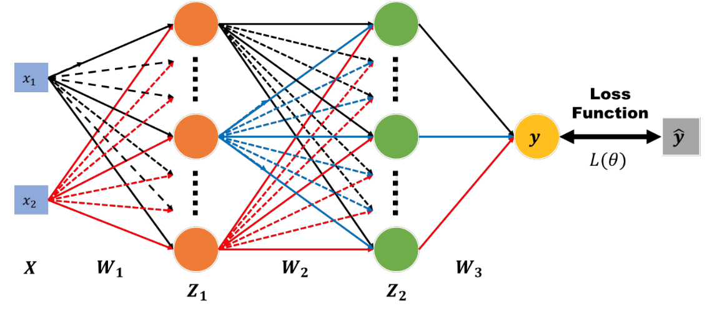
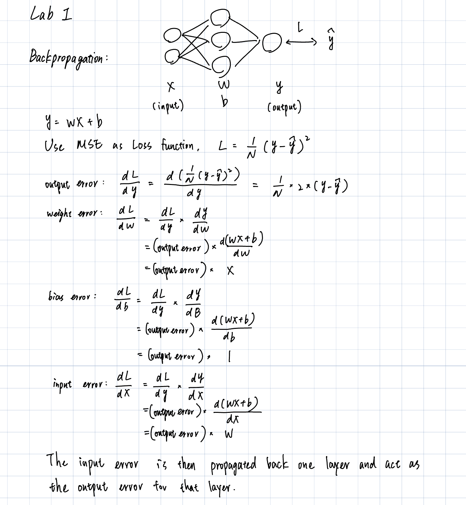

# Implementing neural network backpropagation from scratch with numpy

## What will be implemented
A simple neural network with 2 hidden layers.
- [Layers](model/layer.py)
  - Fully connected layer
  - Convolutional layer
- [Activation functions](model/activation.py)
  - Sigmoid
  - ReLU
  - tanh
- Backpropagation
  - Gradient descent
- [Loss function](model/loss.py)
  - Mean Squared Error (MSE)
- [Optimizer](model/optimizer.py)
  - Stochastic Gradient Descent (SGD)
  - Momentum

## Instructions
#### Environment setup
Only `numpy` and `matplotlib` are required to run the code. 
You can install the required packages using the following command:
```bash
pip install numpy matplotlib
```

#### Run the code
- `train.py`: trains a simple neural network on a linear dataset and an XOR dataset.
- `different_lr.py`: compares the effect of different learning rates on the training process.
- `different_hidden_size.py`: compares the effect of different hidden unit sizes on the training process.
- `different_activation.py`: compares the effect of different activation functions (sigmoid, ReLU, tanh) on the training process.
- `without_activation.py`: compares the effect of not using any activation function on the training process (especially on the XOR dataset).

## Concepts

### Activation function
The sigmoid function is used as the activation function in the hidden layer of the neural network. The sigmoid function is defined as follows:
```
sigmoid(x) = 1 / (1 + np.exp(-x))
```
There are some properties of the sigmoid function:
- The sigmoid function is differentiable.
- The sigmoid function is monotonically increasing.
- The sigmoid function is bounded between 0 and 1.

### Loss function
The Mean Squared Error (MSE) is used as the loss function. The MSE is defined as follows:
```
MSE = 1/N * sum((y - y_pred)^2)
```

### Neural network
The neural network is implemented with the following structure:
- Input layer: 2 neurons
- 1st Hidden layer: 4 neurons
- 2nd Hidden layer: 4 neurons
- Output layer: 1 neuron




### Backpropagation
The backpropagation algorithm is used to train the neural network. The backpropagation algorithm is implemented as follows:
1. Forward pass
    - Calculate the output of each layer.
2. Backward pass
    - Calculate the gradient of the loss function with respect to the output of each layer.
    - Update the weights of each layer using the gradient descent algorithm.


